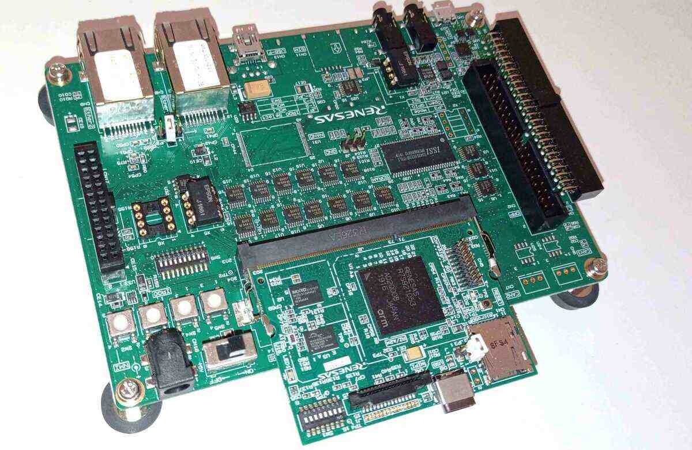
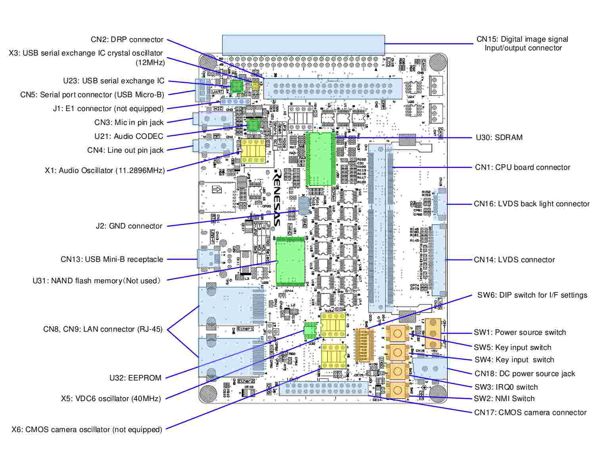
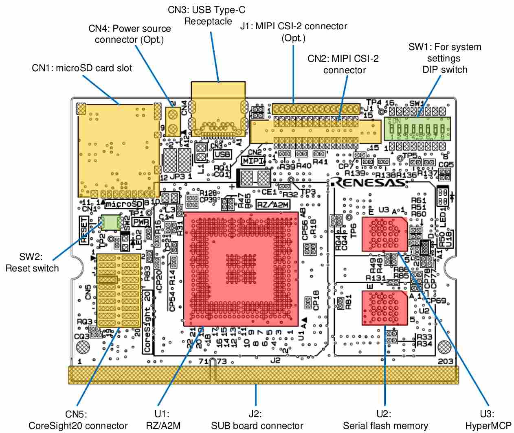

.. _rz_a2m:

Renesas RZ A2M
##############

Overview
********
RZ/A2M can be used in applications that require an advanced HMI infrastructure
and ecosystem as well superior acceleration technology for innovative embedded
artificial intelligence, computer vision and image processing use cases.

Hardware
********
The RZ A2M includes:

* Arm Cortex-A9 processor;
* 4-Mbyte RAM;
* HyperBusTM controller;
* Octa memory controller;
* IEEE 1588 PTP compliant Ethernet MAC controller;
* USB 2.0 host/function module;
* Video display controller;
* Image renderer engine;
* 2D drawing engine;
* MIPI CSI-2 interface;
* SD/MMC host interface.

Connections and IOs
===================

RZ A2M board
------------

Views of the EVK board:

Here layout of components figures for RZ A2M EVK board:

Supported Features
==================
The Renesas ``rz_a2m`` board configuration supports the following
hardware features:

+-----------+------------------------------+-------------------------------------+
| Interface | Driver/components            | Support level                       |
+===========+==============================+=====================================+
| PINCTRL   | pinctrl                      |                                     |
+-----------+------------------------------+-------------------------------------+
| CLOCK     | clock_control                |                                     |
+-----------+------------------------------+-------------------------------------+
| UART      | uart                         | serial port-polling;                |
|           |                              | serial port-interrupt;              |
|           |                              | serial port-asynchronous            |
+-----------+------------------------------+-------------------------------------+
| GPIO      | gpio                         |                                     |
+-----------+------------------------------+-------------------------------------+
| WATCHDOG  | wdt                          | independent watchdog                |
+-----------+------------------------------+-------------------------------------+
| PWM       | pwm                          | capture/pwm saw-waves               |
+-----------+------------------------------+-------------------------------------+
| I2C       | i2c controller               | 10-bit addresses/target API/DMA mode|
+-----------+------------------------------+-------------------------------------+
| DMA       | Direct Memory Access         |                                     |
+-----------+------------------------------+-------------------------------------+
| RTC       | rtc                          | alarm/update/calibration            |
+-----------+------------------------------+-------------------------------------+
| OSTM      | system clock                 |                                     |
+-----------+------------------------------+-------------------------------------+
| BSC       | Bus state controller         |                                     |
+-----------+------------------------------+-------------------------------------+
| INT       | Interrupt controller         |                                     |
+-----------+------------------------------+-------------------------------------+
| MTU       | pwm                          | period capture/pwm saw-waves        |
+-----------+------------------------------+-------------------------------------+
| Flash     | Flash controller             | One serial flash connected          |
+-----------+------------------------------+-------------------------------------+
| SPI       | Serial Peripheral Interface  | 8 or 16bit/async/DMA transfers      |
+-----------+------------------------------+-------------------------------------+
| ETHERC    | Ethernet controller          | fixed-link/brodcast/VLAN            |
+-----------+------------------------------+-------------------------------------+
| Touch     | Touch panel controller       |                                     |
+-----------+------------------------------+-------------------------------------+
| USB       | USB 2.0 controller           |                                     |
+-----------+------------------------------+-------------------------------------+
| I2S       | Serial Sound Interface       |                                     |
+-----------+------------------------------+-------------------------------------+

Other hardware features have not been enabled yet for this board.

The default configuration can be found in the defconfig file:

        ``boards/arm/rz_a2m/rz_a2m_defconfig``

Programming and Debugging
*************************

Applications for the ``rz_a2m`` board configuration can be
built and flashed in the usual way (see :ref:`build_an_application`
and :ref:`application_run` for more details); as board has internal Segger
J-Link for debug purposes.

Flashing
========

Follow the instructions in the :ref:`nordic_segger` page to install
and configure all the necessary software. Further information can be
found in :ref:`nordic_segger_flashing`. Then build and flash
applications as usual (see :ref:`build_an_application` and
:ref:`application_run` for more details).

Here is an example for the :ref:`blinky-sample` application.

.. zephyr-app-commands::
   :zephyr-app: samples/basic/blinky
   :board: rz_a2m
   :goals: build flash

References
**********

.. _Renesas RZ/A2M Image Processing RTOS MPU with DRP and 4MB of On-chip RAM:
   https://www.renesas.com/us/en/products/microcontrollers-microprocessors/rz-mpus/rza2m-image-processing-rtos-mpu-drp-and-4mb-chip-ram
