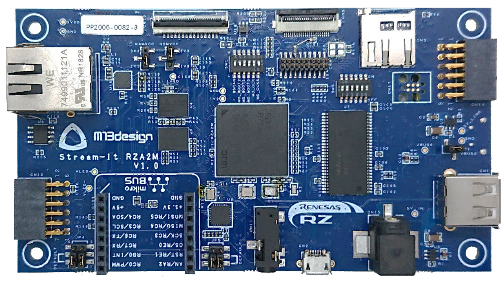
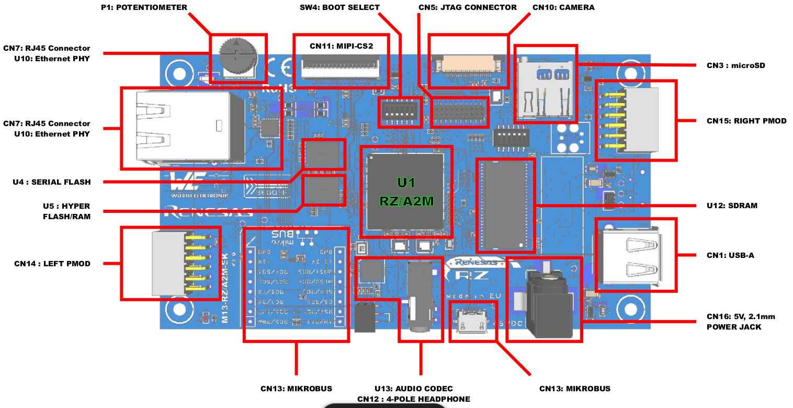
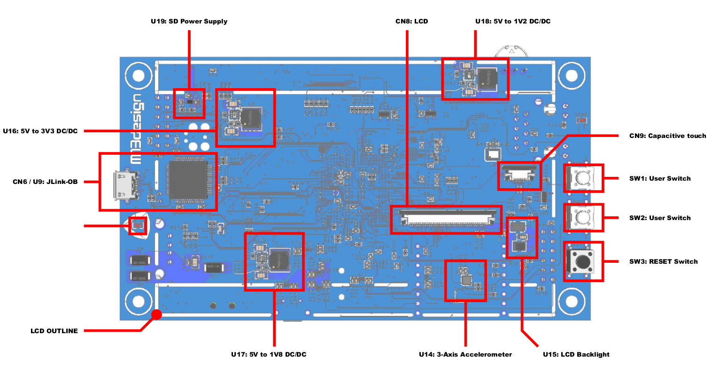

.. _rz_a2m:

Renesas RZ A2M
##############

Overview
********
RZ/A2M can be used in applications that require an advanced HMI infrastructure
and ecosystem as well superior acceleration technology for innovative embedded
artificial intelligence, computer vision and image processing use cases.

Hardware
********
The RZ A2M includes:

* Arm Cortex-A9 processor;
* 4-Mbyte RAM;
* HyperBusTM controller;
* Octa memory controller;
* IEEE 1588 PTP compliant Ethernet MAC controller;
* USB 2.0 host/function module;
* Video display controller;
* Image renderer engine;
* 2D drawing engine;
* MIPI CSI-2 interface;
* SD/MMC host interface.

Connections and IOs
===================

RZ A2M board
------------

Vies of board:

Here IOs figures for RZ A2M board:

Supported Features
==================
The Renesas ``rz_a2m`` board configuration supports the following
hardware features:

+-----------+------------------------------+--------------------------------+
| Interface | Driver/components            | Support level                  |
+===========+==============================+================================+
| PINCTRL   | pinctrl                      |                                |
+-----------+------------------------------+--------------------------------+
| CLOCK     | clock_control                |                                |
+-----------+------------------------------+--------------------------------+
| UART      | uart                         | serial port-polling            |
+-----------+------------------------------+--------------------------------+
| MMC       | renesas_rcar_mmc             |                                |
+-----------+------------------------------+--------------------------------+

Other hardware features have not been enabled yet for this board.

The default configuration can be found in the defconfig file:

        ``boards/arm/rz_a2m/rz_a2m_defconfig``

Programming and Debugging
*************************

Flashing
========

The flash on board is not supported by Zephyr at this time.

References
**********

.. _Renesas RZ/A2M Image Processing RTOS MPU with DRP and 4MB of On-chip RAM:
   https://www.renesas.com/us/en/products/microcontrollers-microprocessors/rz-mpus/rza2m-image-processing-rtos-mpu-drp-and-4mb-chip-ram
