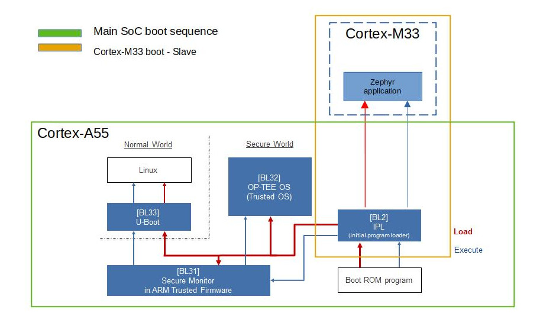

RZ G3S MPU boot sequence
------------------------

The Renesas RZ G3S MPU boot sequence is illustrated by below diagram:

As can be seen from Boot diagram the main Renesas RZ G3S MPU boot sequence is executed on Cortex-A55 System Core after SoC power-on/reset.
The cold boot from Cortex-M33(FPU) System core is not supported.

After reset the Boot ROM program is started and loads and starts TF-A BL2 initial program loader.
Then TF-A BL2 loads BL31 (image id=3), BL32 (optionally, image id=4) and BL33 (u-boot, image id=5) from either QSPI or eMMC.

In addition to the above, the TF-A BL2 is intended to load and start firmware (Zephyr application, image id=36) on Cortex-M33 System core.
For which the TF-A has to be built with `PLAT_M33_BOOT_SUPPORT=1` option as described in :ref:`Building yocto image`.

The TF-A performs the following steps without which Zephyr application can't be started on Cortex-M33 System core:

* clocks (PLLs) configuration
* enabling core IPs
* secure configuration
* loading Cortex-M33 firmware (Zephyr application) in RAM
* configuring Cortex-M33 Core (SysTick timer, reset vector address)
* starting Cortex-M33 Core
