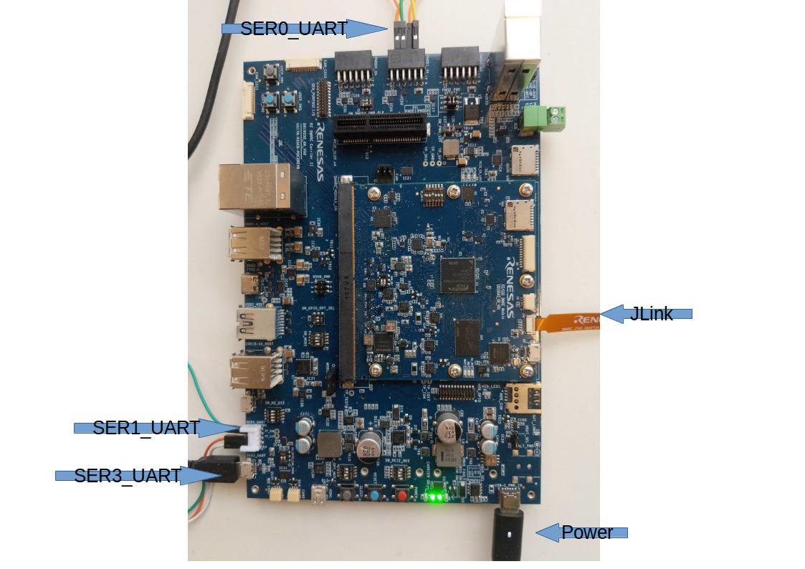
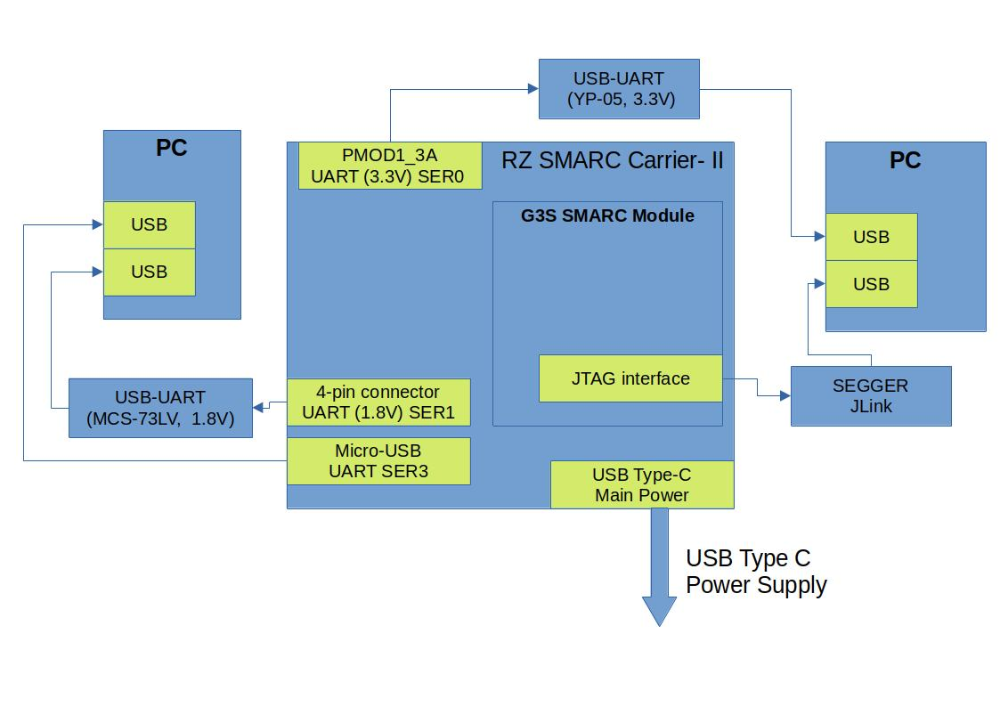
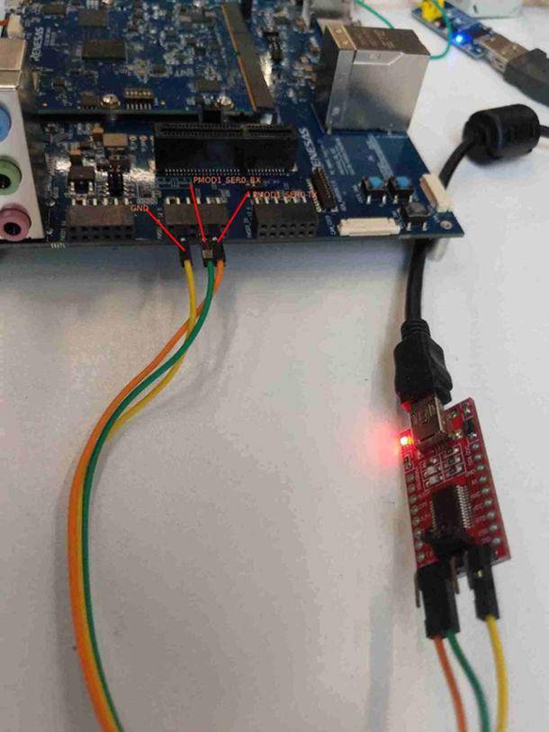
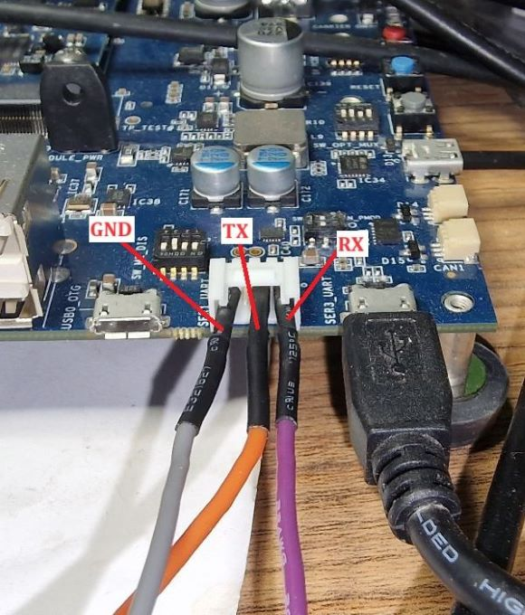
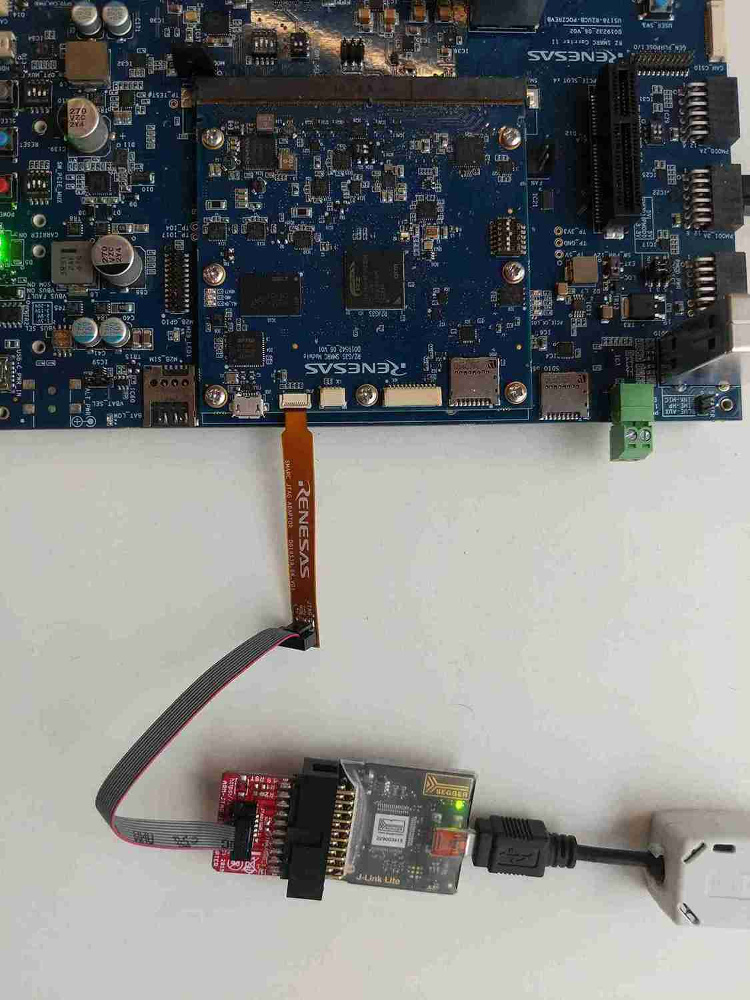

.. _rz_g3s_con:

RZ/G3S-EVKIT board connection
-----------------------------

Views of the Renesas RZ/G3S SMARC Evaluation Board Kit board ``rz_g3s``:



The connection diagram of RZ/G3S-EVKIT and PC is shown below:



* USB Type-C Main Power - connected to USB Type-C power supply
* micro-USB SER3_UART - shell be connected to PC.
  It's used as console for SW running on Cortex-A55 System Core.
* PMOD1_3A SER0_UART (3.3V) - shell be connected to PC using UART-USB adapter, like YP-05.
  It's used as console for SW running on Cortex-M33 System Core.



The connection schema is the following:

* USB->SERIAL RX -> PMOD1_3A PIN2 (PMOD1_SER0_TX)
* USB->SERIAL TX -> PMOD1_3A PIN3 (PMOD1_SER0_RX)
* USB->SERIAL GND -> PMOD1_3A PIN5 (GND)

Link: `YP-05 adapter`_.

.. _YP-05 adapter: https://www.ebay.com/itm/144718688888

* 4-pin connector SER1_UART (1.8V) - shell be connected to PC using UART-USB adapter, like MCS-73LV.
  It's used as console for SW running on Cortex-M33_FPU System Core.



* USB->SERIAL RX -> SER1_UART PIN1
* USB->SERIAL TX -> SER1_UART PIN2
* USB->SERIAL GND -> SER1_UART PIN4

Link: `MCS-73LV adapter`_.

.. _MCS-73LV adapter: https://www.amazon.com/Level-Serial-Converter-Adapter-Module/dp/B0CDHHGGCV

* The G3S SMARC Module JTAG interface - shell be connected to PC through SEGGER JLink probe



Link to the SEGGER JLink software: `JLink istallation page`_.
Please install JLink software version V7.96 or later.

.. _JLink istallation page: https://www.segger.com/downloads/jlink/

.. _Linux minicom terminal:

Linux minicom terminal
``````````````````````
The **minicom** is a terminal program for Linux and other unix-like systems. Use below command to connect to the dedicated serial device:

.. code-block:: bash

    sudo minicom -D /dev/<tty dev>

When console port of RZ/G3S-EVKIT is connected to PC it will create TTY **/dev/ttyX** device.
The device name depends on UART-USB converter HW and usually named as **/dev/ttyUSBN**, where **N** - the number assigned by Linux and it depends on connection or re-connection of (plug/unplug UCN cable) UART-USB converter HW to PC.

For example:

* connect micro-USB SER3_UART to PC - the **/dev/ttyUSB0** serial device will be created (Cortex-A55)
* connect PMOD1_3A SER0_UART to PC - the **/dev/ttyUSB1** serial device will be created (Cortex-M33)
* connect SER1_UART to PC - the **/dev/ttyUSB2** serial device will be created (Cortex-M33_FPU)

Run below three commands in different terminal windows to access RZ G3S Cortex-A55 and Cortex-M33 console:

.. code-block:: bash

    sudo minicom -D /dev/ttyUSB0
    sudo minicom -D /dev/ttyUSB1
    sudo minicom -D /dev/ttyUSB2

Minicom configuration should be the following:

* Bps/Par/Bits: 115200 8N1
* Hardware Flow Control: No
* Software Flow Control: No

.. _rz_g3s_hw_conf:

RZ/G3S-EVKIT board default HW configuration
-------------------------------------------

This section describes default RZ/G3S-EVKIT board configuration used for basic Zephyr testing.
It enables eMMC boot by default.

G3S SMARC Module:

* DIP Switch **SW_CONFIG**: **1:OFF 2:OFF 3:ON 4:OFF 5:OFF 6:OFF**
* DIP Switch **GPIO4_SEL**: **(2-3, 5-6)**

The RZ SMARC Carrier II:

* DIP switch **SW_MODE** (Boot Mode): **1:ON 2:OFF 3:OFF**. Module eMMC flash E.g. eMMC
* DIP switch **SW_MODE** (Power): **4:ON** (15V, 2A, 30W, VBUS_SEL=3)
* DIP switch **SW_OPT_MUX**: **1:OFF 2:ON 3:OFF 4:ON**
* DIP switch **SW_GPIO_CAN_PMOD** (CAN Standby): **(2-3, 5-6)**
* JP **PMOD_PWR_SEL** (PMOD Power):  should be configured to supply 3.3V
* DIP switch **SW_PMOD0_PWR_SLP** (PMOD Power/Sleep Control): **(2-3, 5-6)**
* DIP switch **SW_GPIO_OPT_SEL** (GPIO Options): **(2-3, 5-6)**
* DIP switch **SW_M2_DIS** (M.2 Card Control Signals): **1:ON 2:ON 3:ON 4:ON**
* DIP switch **SW_PCIE_MUX**: **1:ON 2:OFF 3:OFF 4:ON**

RZ/G3S-EVKIT power on
---------------------

* Validate DIP switch settings according to the :ref:`rz_g3s_hw_conf`
* Attach all external Hardware and connect to the console according to the :ref:`rz_g3s_con`
* Do the preparations according to the Section 4.2 Startup Procedure of `Linux Start-up Guide for RZ/G3S Board Support Package`_
* Turn on the board

.. _Linux Start-up Guide for RZ/G3S Board Support Package: https://www.renesas.com/us/en/document/mas/linux-start-guide-rzg3s-board-support-package-v100
