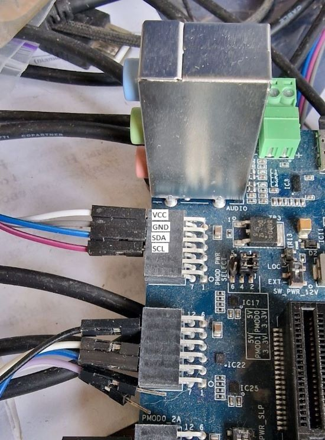

I2C Bus Interface (I2C)
=======================

I2C overview
------------

The Renesas RZ G3S Soc has 4 channels of the I2C bus interface (RIIC).

Refer to "I2C Bus Interface" section in "Renesas RZ/G3S Group User’s Manual: Hardware"

I2C driver overview
-------------------

Zephyr RZ/G3S Renesas I2C driver provides Zephyr :ref:`i2c_api` System interface implementation.

The I2C subsystem is **not** enabled by default in ``rz_g3s_defconfig``. To enable Zephyr
I2C functionality and RZ G3S I2C driver below Kconfig options have to be enabled:

.. code-block:: text

    CONFIG_I2C=y
    /* automatically enabled */
    CONFIG_I2C_RIIC=y

The RZ G3S I2C driver code can be found at:

.. code-block:: text

    drivers/i2c/i2c_riic.c

Current implementation of I2C driver supports DMA transfer. Currently DMA used if amount of
transferred bytes more then 6 for read and more then 1 for write.

DMA transfer capability in RZ G3C I2C driver below Kconfig options have to be enabled:

.. code-block:: text

    CONFIG_I2C_RIIC_DMA_DRIVEN=y

I2C testing
-----------

samples/sensor/bme280
`````````````````````

BME280 sensor (or any I2C device) can be connected to the PMOD1_6A connector as shown on picture:



Zephyr RZ/G3S I2C driver can be tested by using **bme280** sample application with BME280 sensor.
To build **bme280** test run command:

.. code-block:: bash

    west build -b rz_g3s -p always samples/sensor/bme280

Console output:

.. code-block:: console

    [00:00:00.004,000] <dbg> BME280: bme280_chip_init: ID OK
    [00:00:00.038,000] <dbg> BME280: bme280_chip_init: "bme280@76" OK
    *** Booting Zephyr OS build zephyr-v3.3.0-10473-g1380b66bc483 ***
    Found device "bme280@76", getting sensor data
    temp: 20.740000; press: 98.004894; humidity: 57.391601
    temp: 20.740000; press: 98.005222; humidity: 57.368164
    temp: 20.740000; press: 98.005468; humidity: 57.322265
    temp: 20.740000; press: 98.006050; humidity: 57.379882
    temp: 20.740000; press: 98.006628; humidity: 57.402343
    temp: 20.740000; press: 98.006628; humidity: 57.345703
    temp: 20.740000; press: 98.006628; humidity: 57.402343
    temp: 20.740000; press: 98.006464; humidity: 57.414062
    temp: 20.740000; press: 98.006628; humidity: 57.357421
    temp: 20.750000; press: 98.006910; humidity: 57.312500
    temp: 20.750000; press: 98.006578; humidity: 57.358398
    temp: 20.750000; press: 98.006085; humidity: 57.403320
    temp: 20.750000; press: 75.098539; humidity: 57.426757
    temp: 20.760000; press: 98.004425; humidity: 60.697265
    temp: 21.560000; press: 98.005820; humidity: 79.519531
    temp: 21.920000; press: 98.005921; humidity: 80.390625
    temp: 22.750000; press: 98.004371; humidity: 90.697265
    temp: 23.350000; press: 98.005582; humidity: 88.872070
    temp: 23.660000; press: 98.005925; humidity: 87.301757
    temp: 24.590000; press: 98.006113; humidity: 96.233398
    temp: 25.030000; press: 98.007187; humidity: 92.700195
    temp: 25.290000; press: 98.170148; humidity: 93.313476
    temp: 25.720000; press: 98.259449; humidity: 97.685546
    temp: 26.110000; press: 98.343542; humidity: 98.500976
    temp: 26.440000; press: 98.409437; humidity: 98.906250
    temp: 26.710000; press: 98.454328; humidity: 98.942382
    temp: 26.930000; press: 98.481500; humidity: 98.909179
    temp: 27.100000; press: 98.495117; humidity: 98.899414
    temp: 27.230000; press: 98.496042; humidity: 98.838867
    temp: 27.340000; press: 98.484203; humidity: 98.780273
    temp: 27.420000; press: 98.461601; humidity: 98.681640

To build **bme280** test run command with DMA support:

.. code-block:: bash

    west build -b rz_g3s -p always samples/sensor/bme280 -S rz-g3s-i2c-dma

Console output looks the same as above.

.. raw:: latex

    \newpage
