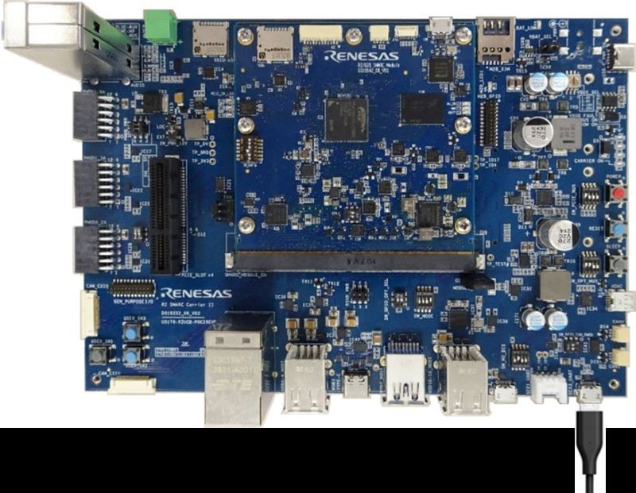

.. _rz_g3s:
.. _rz_g3s_fpu:

#################################
RZ/G3S SMARC Evaluation Board Kit
#################################

.. only:: html

  .. contents::
     :depth: 5

Overview
********
This evaluation board kit is ideal for evaluating RZ/G3S. The RZ/G3S Evaluation Board Kit consists
of a module board (SOM) and a carrier board. The module board complies with the SMARC v2.1 standard.

.. toctree::
   :maxdepth: 4

   delivery/delivery_scope.rst
   delivery/getting_source_code.rst
   delivery/initial_config.rst

Hardware
********

The RZ G3S includes:

* Device: RZ/G3S R9A08G045S33GBG

  * Cortex-A55 Single, Cortex-M33 x2
  * BGA 359-pin, 14mmSq body, 0.5mm pitch

* Module Board Functions

  * LPDDR4 SDRAM: 1GB × 1pc
  * QSPI flash memory: 128Mb × 1pc
  * eMMC memory: 64GB × 1pc
  * PMIC power supply RAA215300A2GNP#HA3 implemented
  * microSD card x2
  * I3C connector
  * JTAG connector
  * ADC x8 channels
  * Current monitor (USB Micro B)

* Carrier Board Functions

  * Gigabit Ethernet x2
  * USB2.0 x2ch (OTG x1ch, Host x1ch)
  * CAN-FD x2
  * microSD card x1
  * Mono speaker, Stereo headphone, Mic., and Aux..
  * PMOD x2
  * USB-Type C for power input
  * PCIe Gen2 4-lane slot (G3S supports only 1-lane)
  * M.2 Key E
  * M.2 Key B and SIM card
  * Coin cell battery holder (3.0V support)

Connections and IOs
===================

RZ G3S board
------------

Views of the Renesas RZ/G3S SMARC Evaluation Board Kit board ``rz_g3s``:

Supported Features
==================

The Renesas ``rz_g3s`` board configuration supports the following
hardware features:

+----------+---------------------------+--------------------------------+
| Interface| Driver/components         | Support level                  |
+==========+===========================+================================+
| PINCTRL  | pinctrl                   |                                |
+----------+---------------------------+--------------------------------+
| CLOCK    | clock_control             |                                |
+----------+---------------------------+--------------------------------+
| gpio     | gpio                      |                                |
+----------+---------------------------+--------------------------------+
| UART     | uart                      | serial port-polling            |
+----------+---------------------------+--------------------------------+
| rSPI     | spi                       | 8/16 bit transfers             |
+----------+---------------------------+--------------------------------+
| I2C      | i2c                       |                                |
+----------+---------------------------+--------------------------------+
| Watchdog | wdt                       |                                |
+----------+---------------------------+--------------------------------+
| ADC      | adc                       |                                |
+----------+---------------------------+--------------------------------+
| CAN-FD   | can                       |                                |
+----------+---------------------------+--------------------------------+

Other hardware features have not been enabled yet for this board.

The default configuration can be found in the defconfig file:

.. code-block:: text

    boards/arm/rz_g3s/rz_g3s_defconfig

.. _rz_g3s_prog_debug:

Programming and Debugging
*************************

Applications for the ``rz_g3s`` board can be built in the usual way as documented
in :ref:`build_an_application`.

The generating of binaries for RZ G3S Cortex-M33 and Cortex-M33_FPU system cores is
supported by using different board names:

* ``rz_g3s`` for Cortex-M33
* ``rz_g3s_fpu`` for Cortex-M33_FPU

These are the memory mapping for A55 and M33:

+----------+-----------------------+-----------------------+
| Region   | Cortex-M33            | Cortex-M33-FPU        |
+==========+=======================+=======================+
| SRAM code| 0x00023000-0x0004FFFF | 0x00063000-0x0008FFFF |
+----------+-----------------------+-----------------------+
| SRAM data| 0x20050000-0x2005FC00 | 0x20090000-0x2009FC00 |
+----------+-----------------------+-----------------------+
| DDR      | 0x60000000-0x60FFFFFF | 0x61000000-0x61FFFFFF |
+----------+-----------------------+-----------------------+

Console
=======

There are 2 UART ports supported from Zephyr on RZ/G3S SMARC Evaluation Board Kit board,
which assigned to Cortex-M33 System Cores as following:

* Cortex-M33: SER0 from PMOD1_3A
* Cortex-M33_FPU: SER1 from SER1_UART

Debugging
=========

It is possible to load and execute a Zephyr application binary on
this board one of the Cortex-M33/Cortex-M33_FPU System Cores from
the internal SRAM, using ``JLink`` debugger (:ref:`jlink-debug-host-tools`).

.. note::

    Currently it's required Renesas  ATF-A to be started on Cortex-A55 System Core
    before starting Zephyr. As it's affecting at code start address.

+----------------+--------------------+
|                | JLink device id    |
+================+====================+
| Cortex-M33     | R9A08G045S33_M33_0 |
+----------------+--------------------+
| Cortex-M33_FPU | R9A08G045S33_M33_1 |
+----------------+--------------------+

Here is an example for the :ref:`hello_world` application.

.. zephyr-app-commands::
   :zephyr-app: samples/hello_world
   :board: rz_g3s
   :goals: build

.. zephyr-app-commands::
   :zephyr-app: samples/hello_world
   :board: rz_g3s_fpu
   :goals: build

Flashing
========

The flashing using west environment is not supported.

Zephyr application can be flashed to eMMC or qSPI storage and then loaded by
Renesas ATF-A running on Cortex-A55 System Core.
The Renesas ATF-A should be configured to enable support for loading
and staring binary at Cortex-M33 System Core.

.. note::

    Flashing is supported only for Cortex-M33 System Core.
    Zephyr application can be started on Cortex-M33_FPU System Core only using debugger.

Refer to "Renesas SMARC EVK of RZ/G3S Linux Start-up Guide".

Flashing on eMMC
----------------

Zephyr binary has to be converted to **srec** format.

* Follow "Renesas SMARC EVK of RZ/G3S Linux Start-up Guide" to enable **SCIF Download Mode** and
  load **Flash Writer**.
* Use **Flash Writer EM_W** command to flash Zephyr binary. Input when asked:

.. code-block:: console

    Please Input Start Address in sector :1000
    Please Input Program Start Address : 23000

* then send Zephyr **srec** file from terminal (use ''ascii'').
* reboot the board in the **eMMC Boot Mode**

.. code-block:: console

    >EM_W
    EM_W Start --------------
    ---------------------------------------------------------
    Please select,eMMC Partition Area.
    0:User Partition Area : 62160896 KBytes
     eMMC Sector Cnt : H'0 - H'0768FFFF
    1:Boot Partition 1 : 32256 KBytes
     eMMC Sector Cnt : H'0 - H'0000FBFF
    2:Boot Partition 2 : 32256 KBytes
     eMMC Sector Cnt : H'0 - H'0000FBFF
    ---------------------------------------------------------
     Select area(0-2)>1
    -- Boot Partition 1 Program -----------------------------
    Please Input Start Address in sector :1000
    Please Input Program Start Address : 23000
    Work RAM (H'00020000-H'000FFFFF) Clear....
    please send ! ('.' & CR stop load)

Flashing on qSPI
----------------

Zephyr binary has to be converted to **srec** format.

* Follow "Renesas SMARC EVK of RZ/G3S Linux Start-up Guide" to enable **SCIF Download Mode** and
  load **Flash Writer**.
* Use **Flash Writer XLS2** command to flash Zephyr binary. Input when asked:

.. code-block:: console

    ===== Please Input Program Top Address ============
      Please Input : H'23000
    ===== Please Input Qspi Save Address ===
      Please Input : H'200000

* then send Zephyr **srec** file from terminal (use ''ascii'').
* reboot the board in the **qSPI Boot Mode**

.. code-block:: console

     -- Load Program to SRAM ---------------

    Flash writer for RZ/G3S Series V0.60 Jan.26,2023
     Product Code : RZ/G3S
    >XLS2
    ===== Qspi writing of RZ/G2 Board Command =============
    Load Program to Spiflash
    Writes to any of SPI address.
    Program size & Qspi Save Address
    ===== Please Input Program Top Address ============
      Please Input : H'23000

    ===== Please Input Qspi Save Address ===
      Please Input : H'200000
    please send ! ('.' & CR stop load)
    I Flash memory...
    Erase Completed
    Write to SPI Flash memory.
    ======= Qspi  Save Information  =================
     SpiFlashMemory Stat Address : H'00200000
     SpiFlashMemory End Address  : H'002098E6
    ===========================================================

Supported Features Details
**************************

.. toctree::
   :maxdepth: 4

   cortex-m/fpu.rst
   cortex-m/mpu.rst
   cortex-m/systick.rst
   cortex-m/sau.rst
   cpg/cpg.rst
   pinctrl/pinctrl.rst
   icu/interrupts.rst
   uart/uart.rst
   gpio/gpio.rst
   rspi/rspi.rst
   i2c/i2c.rst
   wdt/wdt.rst
   adc/adc.rst
   canfd/canfd.rst
   ostm_gtm/ostm_gtm.rst
   openamp/mhu.rst
   openamp/openamp.rst
   pwm/GPT.rst
