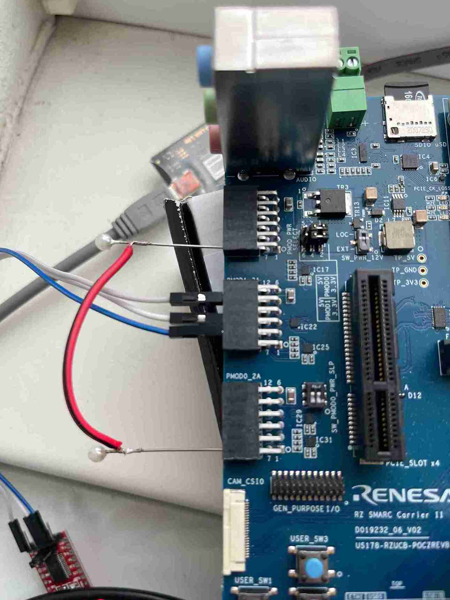
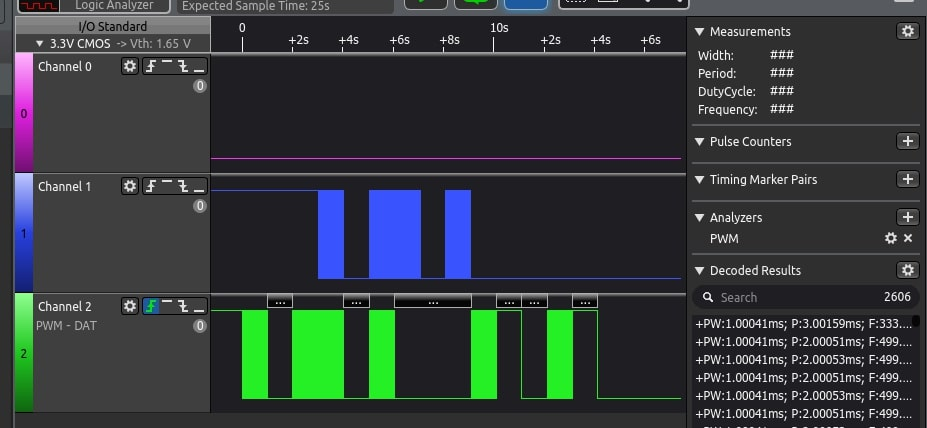

General PWM Timer (GPT)
=======================

GPT overview
------------

The Renesas RZ G3S Soc has general purpose PWM timer (GPT) composed of 8 channels of 32-bit timer (GPT32E)
for Secure and Non-Secure space.

Refer to "General PWM Timer (GPT)" section in "Renesas RZ/G3S Group User’s Manual: Hardware"

GPT driver overview
-------------------

Zephyr RZ/G3S Renesas GPT driver provides Zephyr :ref:`pwm_api` interface implementation.

The PWM subsystem is **not** enabled by default in ``rz_g3s_defconfig``. To enable Zephyr
PWM functionality below Kconfig options have to be enabled:

.. code-block:: text

    CONFIG_PWM=y

Default pwm devices can be set in the alias section:

.. code-block:: dts

    aliases {
        pwm-0 = &gpt32e0;
        pwm-1 = &gpt32e3;
    };

This aliases are setting the default *pwm-0* and *pwm-1* devices that are used by the system.

The RZ G3S PWM driver code can be found at:

.. code-block:: text

    drivers/pwm/pwm_rza2m.c

This driver is compatible with RZ/A2M driver so the implementation is shared.

Limitations
````````````
* Only saw-wave mode is supported by now;
* External pins input is not supported;
* Two in pins in the same channel is not supported;
* Capturing both A and B channels is not supported;
* Overflow handling is not implemented.

GPT testing
-----------

tests/drivers/pwm/pwm_api
``````````````````````````
Zephyr RZ/G3S GPT driver can be tested by using **pwm_api** tests application.
Use below command to build GPT test application:

.. code-block:: bash

    west build -p always -b rz_g3s tests/drivers/pwm/pwm_api

**pwm_api** test can be found in the Zephyr source code on the following
path:

.. code-block:: bash

    ./tests/drivers/pwm/pwm_api/

This test is part of the Zephyr test collection. The details about the
test work can be found in the comment on top of the test source file:

.. code-block:: bash

    ./tests/drivers/pwm/pwm_api/src/test_pwm.c

**NOTE**: Please connect multimeter or similar analyzing tool to PMOD1_6A pin 7 to
see the PWM output.

Console output:

.. code-block:: console

    *** Booting Zephyr OS build v2.5.0-rc2-339-gcd6600121b35 ***
    Running TESTSUITE pwm_basic
    ===================================================================
    START - test_pwm_cycle
    [PWM]: 0, [period]: 64000, [pulse]: 32000
    [PWM]: 0, [period]: 64000, [pulse]: 64000
    [PWM]: 0, [period]: 64000, [pulse]: 0
     PASS - test_pwm_cycle in 3.011 seconds
    ===================================================================
    START - test_pwm_nsec
    [PWM]: 0, [period]: 2000000, [pulse]: 1000000
    [PWM]: 0, [period]: 2000000, [pulse]: 2000000
    [PWM]: 0, [period]: 2000000, [pulse]: 0
     PASS - test_pwm_nsec in 3.012 seconds
    ===================================================================
    TESTSUITE pwm_basic succeeded

    ------ TESTSUITE SUMMARY START ------

    SUITE PASS - 100.00% [pwm_basic]: pass = 2, fail = 0, skip = 0, total = 2 duration = 6.023 seconds
     - PASS - [pwm_basic.test_pwm_cycle] duration = 3.011 seconds
     - PASS - [pwm_basic.test_pwm_nsec] duration = 3.012 seconds

    ------ TESTSUITE SUMMARY END ------

    ===================================================================
    PROJECT EXECUTION SUCCESSFUL


tests/drivers/pwm/pwm_loopback
```````````````````````````````

Zephyr RZ/G3S GPT driver can be tested by using **pwm_loopback** test application.
Use below command to build PWM **pwm_loopback** test application:

.. code-block:: bash

    west build -p always -b rz_g3s tests/drivers/pwm/pwm_loopback

**NOTE** Please connect PMOD1_6A pin 7 (GPT ch0) and PMOD0_2A pin 7(GPT ch3) to perform
**pwm_looback** test. The below image shows the connection schema:



Console output:

.. code-block:: console

    *** Booting Zephyr OS build v3.5.0-rc2-336-g84ec9a6d42b4 ***
    Running TESTSUITE pwm_loopback
    ===================================================================
    START - test_capture_busy
    E: gpt32e3@50048300: capture started, pls, stop before reconfigutration
    E: rza2m_pwm_enable_capture:gpt32e3@50048300: capture has been already started
     PASS - test_capture_busy in 0.013 seconds
    ===================================================================
    START - test_capture_timeout
    W: pwm capture timed out
     PASS - test_capture_timeout in 1.003 seconds
    ===================================================================
    START - test_continuous_capture
     PASS - test_continuous_capture in 1.157 seconds
    ===================================================================
    START - test_period_capture
    Testing PWM capture @ 15000000/100000000 nsec
    Testing PWM capture @ 75000/100000 usec
     PASS - test_period_capture in 0.313 seconds
    ===================================================================
    START - test_period_capture_inverted
    Testing PWM capture @ 15000000/100000000 nsec
    Testing PWM capture @ 75000/100000 usec
     PASS - test_period_capture_inverted in 0.388 seconds
    ===================================================================
    START - test_pulse_and_period_capture
    Testing PWM capture @ 15000000/100000000 nsec
    Testing PWM capture @ 75000/100000 usec
     PASS - test_pulse_and_period_capture in 0.387 seconds
    ===================================================================
    START - test_pulse_capture
    Testing PWM capture @ 15000000/100000000 nsec
    Testing PWM capture @ 75000/100000 usec
     PASS - test_pulse_capture in 0.263 seconds
    ===================================================================
    START - test_pulse_capture_inverted
    Testing PWM capture @ 15000000/100000000 nsec
    Testing PWM capture @ 75000/100000 usec
     PASS - test_pulse_capture_inverted in 0.288 seconds
    ===================================================================
    TESTSUITE pwm_loopback succeeded

    ------ TESTSUITE SUMMARY START ------

    SUITE PASS - 100.00% [pwm_loopback]: pass = 8, fail = 0, skip = 0, total = 8 duration = 3.812 seconds
     - PASS - [pwm_loopback.test_capture_busy] duration = 0.013 seconds
     - PASS - [pwm_loopback.test_capture_timeout] duration = 1.003 seconds
     - PASS - [pwm_loopback.test_continuous_capture] duration = 1.157 seconds
     - PASS - [pwm_loopback.test_period_capture] duration = 0.313 seconds
     - PASS - [pwm_loopback.test_period_capture_inverted] duration = 0.388 seconds
     - PASS - [pwm_loopback.test_pulse_and_period_capture] duration = 0.387 seconds
     - PASS - [pwm_loopback.test_pulse_capture] duration = 0.263 seconds
     - PASS - [pwm_loopback.test_pulse_capture_inverted] duration = 0.288 seconds

    ------ TESTSUITE SUMMARY END ------

    ===================================================================
    PROJECT EXECUTION SUCCESSFUL


tests/drivers/pwm/pwm_ab
`````````````````````````

Zephyr RZ/G3S GPT driver can be tested by using **pwm_ab** test application.
This test shows configuration of A and B channels of the PWM device.
It is including the following set of tests:

* Set/clear pulse on channel A of the PWM device
* Set/clear pulse on channel A and channel B of the PWM device
* Set/clear pulse on channel B of the PWM device
* Set channel A to Always on  ->  Period : Pulse (1 : 1)  ->  3.3V
* Set channel A to Half on  ->  Period : Pulse (2 : 1)  ->  1.65V
* Set channel A to Always off  ->  Period : Pulse (1 : 0)  ->  0V

Use below command to build PWM **pwm_ab** test application:

.. code-block:: bash

    west build -p always -b rz_g3s tests/drivers/pwm/pwm_ab

**NOTE** Please connect logic analyzer or similar analyzing tool to PMOD1_6A pin 7 (GPT ch0 A) and PMOD1_6A pin 8(GPT ch0 B)
to perform **pwm_ab** test. The below image shows the connection schema:

.. image:: ../img/pwm_ab_schema.jpg
   :height: 250px
   :align: center

The below image shows the sample wave form on analyzer after successful test:



Console output:

.. code-block:: console

    *** Booting Zephyr OS build v3.5.0-rc2-376-g484f3ddf8e85 ***
    Running TESTSUITE pwm_ab
    ===================================================================
    START - test_pwm_a
    [PWM]: 0, [period]: 2000000, [pulse]: 1000000
    [PWM]: 0, [period]: 2000000, [pulse]: 0
    [PWM]: 0, [period]: 2000000, [pulse]: 1000000
    [PWM]: 0, [period]: 2000000, [pulse]: 0
     PASS - test_pwm_a in 3.015 seconds
    ===================================================================
    START - test_pwm_ab
    [PWM]: 0, [period]: 2000000, [pulse]: 1000000
    [PWM]: c0000000, [period]: 2000000, [pulse]: 1000000
    [PWM]: 0, [period]: 2000000, [pulse]: 0
    [PWM]: c0000000, [period]: 2000000, [pulse]: 0
    [PWM]: 0, [period]: 2000000, [pulse]: 1000000
    [PWM]: c0000000, [period]: 2000000, [pulse]: 1000000
    [PWM]: 0, [period]: 2000000, [pulse]: 0
    [PWM]: c0000000, [period]: 2000000, [pulse]: 0
     PASS - test_pwm_ab in 3.032 seconds
    ===================================================================
    START - test_pwm_b
    [PWM]: c0000000, [period]: 2000000, [pulse]: 1000000
    [PWM]: c0000000, [period]: 2000000, [pulse]: 0
    [PWM]: c0000000, [period]: 2000000, [pulse]: 1000000
    [PWM]: c0000000, [period]: 2000000, [pulse]: 0
     PASS - test_pwm_b in 3.017 seconds
    ===================================================================
    START - test_pwm_cycle
    [PWM]: 0, [period]: 64000, [pulse]: 32000
    [PWM]: 0, [period]: 64000, [pulse]: 64000
    [PWM]: 0, [period]: 64000, [pulse]: 0
     PASS - test_pwm_cycle in 3.011 seconds
    ===================================================================
    START - test_pwm_nsec
    [PWM]: 0, [period]: 2000000, [pulse]: 1000000
    [PWM]: 0, [period]: 2000000, [pulse]: 2000000
    [PWM]: 0, [period]: 2000000, [pulse]: 0
     PASS - test_pwm_nsec in 3.012 seconds
    ===================================================================
    TESTSUITE pwm_ab succeeded

    ------ TESTSUITE SUMMARY START ------

    SUITE PASS - 100.00% [pwm_ab]: pass = 5, fail = 0, skip = 0, total = 5 duration = 15.087 seconds
     - PASS - [pwm_ab.test_pwm_a] duration = 3.015 seconds
     - PASS - [pwm_ab.test_pwm_ab] duration = 3.032 seconds
     - PASS - [pwm_ab.test_pwm_b] duration = 3.017 seconds
     - PASS - [pwm_ab.test_pwm_cycle] duration = 3.011 seconds
     - PASS - [pwm_ab.test_pwm_nsec] duration = 3.012 seconds

    ------ TESTSUITE SUMMARY END ------

    ===================================================================
    PROJECT EXECUTION SUCCESSFUL


.. raw:: latex

    \newpage
