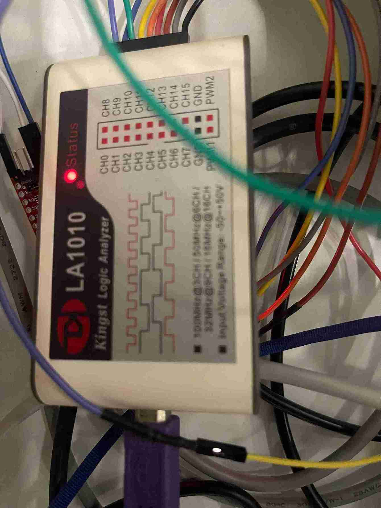
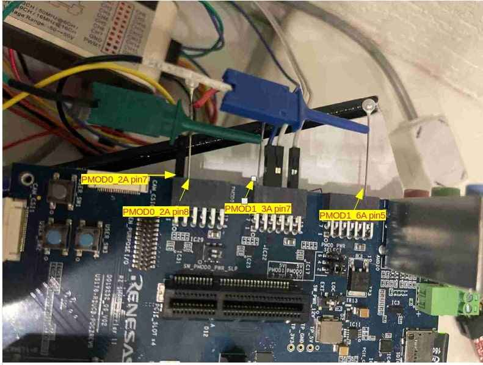
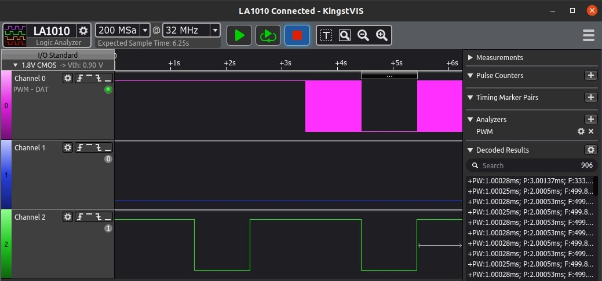
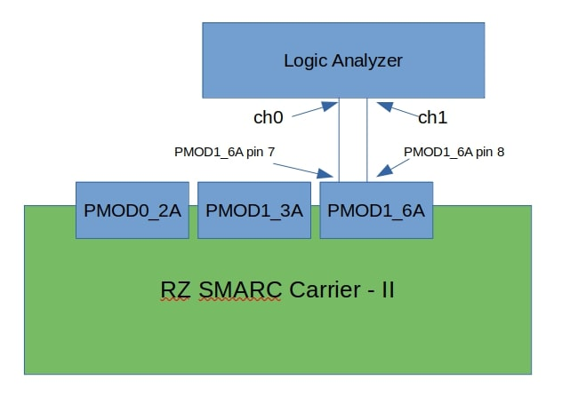
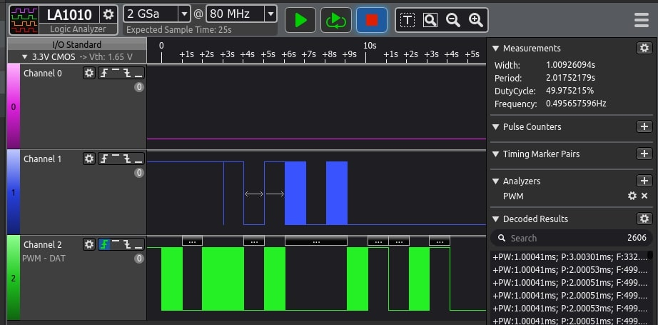

Port Output Enable for GPT (POEG)
=================================

POEG overview
-------------

The output pins of the general PWM timer (GPT) can be disabled by using the port output enabling function for the
GPT (POEG). Specifically, either of the following ways can be used.

* Input level detection of the GTETRGA to GTETRGD pins
* Output-disable request from the GPT
* Register settings

The GTETRGA to GTETRGD pins can also be used as GPT external trigger input pins.

POEG driver overview
--------------------

Zephyr RZ/G3S Renesas POEG driver provides Zephyr `poeg_api` interface implementation.
And should be used with GPT device which provides :ref:`pwm_api` interface.

The PWM subsystem is **not** enabled by default in ``rz_g3s_defconfig``. To enable Zephyr
PWM functionality below Kconfig options have to be enabled:

.. code-block:: text

    CONFIG_PWM=y

Default pwm devices can be set in the alias section:

.. code-block:: dts

    aliases {
        pwm-0 = &gpt32e0;
        pwm-1 = &gpt32e3;
    };

This aliases are setting the default *pwm-0* and *pwm-1* devices that are used by the system.

POEG provides 4 channels to be connected to the PWM devices:

* POEGA
* POEGB
* POEGC
* POEGD

To assign POEG device to the PWM the following configuration should be done:

.. code-block:: dts

    aliases {
        pwm-0 = &gpt32e3;
    };

    &gpt32e3 {
        poeg = "POEGB";
        status = "okay"
        renesas,poeg = "POEGB";
        renesas,poeg-device = <&poegb>;
        renesas,disable-requests = <PWM_HIGH>;;
    };

    &poegb {
        pinctrl-0 = <&poegb_pins>;
        pinctrl-names = "default";
        status = "okay";
    };

    &pinctrl {
        /* P18_1 used as GTETRGB */
        /omit-if-no-ref/ poegb_pins: poegb {
        poegb-pinmux {
            pinmux = <RZG3S_PINMUX(PORT18, 1, 6)>; /* GTETRGB */
        };
    };

See the following overlay as the configuration example:

.. code-block:: text

    test/drivers/pwm/poeg_api/board/rz_g3s.overlay

This example configures GPT3 as PWM-0 device and assigns `POEGB` device to control
channel. Also configures pin P18_1 to work as `GTETRGB` control channel.

The RZ G3S POEG driver code can be found at:

.. code-block:: text

    drivers/pwm/poeg_rzg3.c


Limitations
````````````
* Software enable/disable is not supported.

POEG testing
------------

In POEG testing the following Logic Analyzer was used:



The device can be found on link_.

.. _link: https://www.amazon.com/innomaker-Logic-Analyzer/dp/B07D21GG6J?th=1

tests/drivers/pwm/poeg_api
```````````````````````````
Zephyr RZ/G3S POEG driver can be tested by using **poeg_api** tests application.
Use below command to build GPT test application:

.. code-block:: bash

    west build -p always -b rz_g3s tests/drivers/pwm/poeg_api

**poeg_api** test can be found in the Zephyr source code on the following
path:

.. code-block:: bash

    ./tests/drivers/pwm/poeg_api/

To perform the test please use Logic Analyzer or Oscilloscope to connect to the
following pins:

* connect PMOD1_3A pin 7 (GPT ch0) and PMOD0_2A pin 8
* connect analyzer channel2 to PMOD0_2A pin 8
* connect analyzer channel1 to PMOD0_2A pin 7
* connect analyzer GND to PMOD1_6A pin 5

The below image shows the connection schema:



This test is part of the Zephyr test collection. The details about the
test work can be found in the comment on top of the test source file:

.. code-block:: bash

    ./tests/drivers/pwm/pwm_api/src/test_pwm.c

Console output:

.. code-block:: console

    *** Booting Zephyr OS build v3.5.0-rc2-401-g84154004cb8c ***
    Running TESTSUITE poeg_basic
    ===================================================================
    START - test_poeg_trigger
    Got POEG status 1
    [PWM]: 3, [period]: 2000000, [pulse]: 1000000
    Got POEG status 1
    PASS - test_poeg_trigger in 4.007 seconds
    ===================================================================
    TESTSUITE poeg_basic succeeded

    ------ TESTSUITE SUMMARY START ------

    SUITE PASS - 100.00% [poeg_basic]: pass = 1, fail = 0, skip = 0, total = 1 duration = 4.007 seconds
     - PASS - [poeg_basic.test_poeg_trigger] duration = 4.007 seconds

    ------ TESTSUITE SUMMARY END ------

    ===================================================================
    PROJECT EXECUTION SUCCESSFUL

After the test run the following signal schema should appear on Logic Analyzer sample:



Where Ch2 is GPIO controlled pin and CH0 is PWM output channel. As can be seen - there are 2 interrupts when control pin goes low:

* when GPIO is configured;
* when Control PIN toggles low then PWM timer stops and then restores after 1s.

To perform **poeg_api** test from Cortex-M33_FPU core the following command should be executed:

.. code-block:: bash

    west build -p always -b rz_g3s_fpu tests/drivers/pwm/poeg_api

**poeg_api** test can be found in the Zephyr source code on the following
path:

.. code-block:: bash

    ./tests/drivers/pwm/poeg_api/

To perform the test please use Logic Analyzer or Oscilloscope to connect to the
following pins:

* connect PMOD1_3A pin 7 (GPT ch0) and PMOD0_2A pin 8
* connect analyzer channel2 to PMOD0_2A pin 8
* connect analyzer channel1 to PMOD1_6A pin 7
* connect analyzer GND to PMOD1_6A pin 5

.. code-block:: console

    *** Booting Zephyr OS build v3.5.0-rc2-414-g37387d0cc89b ***
    Running TESTSUITE poeg_basic
    ===================================================================
    START - test_poeg_trigger
    Got POEG status 1
    [PWM]: 0, [period]: 2000000, [pulse]: 1000000
    Got POEG status 1
     PASS - test_poeg_trigger in 4.007 seconds
    ===================================================================
    TESTSUITE poeg_basic succeeded

    ------ TESTSUITE SUMMARY START ------

    SUITE PASS - 100.00% [poeg_basic]: pass = 1, fail = 0, skip = 0, total = 1 duration = 4.007 secs
     - PASS - [poeg_basic.test_poeg_trigger] duration = 4.007 seconds

    ------ TESTSUITE SUMMARY END ------

After the test run the following signal schema should appear on Logic Analyzer sample:


tests/drivers/pwm/pwm_ab
`````````````````````````

Zephyr RZ/G3S POEG driver disable requests can be tested by using **pwm_ab**
test application with snippet.

This test shows configuration of A and B channels of the PWM device.
It is including the following set of tests:

* Set/clear pulse on channel A of the PWM device
* Set/clear pulse on channel A and channel B of the PWM device.
   Channel B is blocked by POEG.
* Set/clear pulse on channel B of the PWM device.
   Channel B non blocked because Channel A is LOW.
* Set channel A to Always on  ->  Period : Pulse (1 : 1)  ->  3.3V
* Set channel A to Half on  ->  Period : Pulse (2 : 1)  ->  1.65V
* Set channel A to Always off  ->  Period : Pulse (1 : 0)  ->  0V

Use below command to build WDT **pwm_ab** test application:

.. code-block:: bash

    west build -p always -b rz_g3s -S rz-g3s-poeg-disa-test tests/drivers/pwm/pwm_ab

**NOTE** Please connect logic analyzer or similar analyzing tool to PMOD1_6A pin 7 (GPT ch0 A) and PMOD1_6A pin 8(GPT ch0 B)
to perform **pwm_ab** test. The below image shows the connection schema:



The below image shows the sample wave form on analyzer after successful test:



Console output:

.. code-block:: console

    *** Booting Zephyr OS build v3.5.0-rc2-376-g484f3ddf8e85 ***
    Running TESTSUITE pwm_ab
    ===================================================================
    START - test_pwm_a
    [PWM]: 0, [period]: 2000000, [pulse]: 1000000
    [PWM]: 0, [period]: 2000000, [pulse]: 0
    [PWM]: 0, [period]: 2000000, [pulse]: 1000000
    [PWM]: 0, [period]: 2000000, [pulse]: 0
     PASS - test_pwm_a in 3.015 seconds
    ===================================================================
    START - test_pwm_ab
    [PWM]: 0, [period]: 2000000, [pulse]: 1000000
    [PWM]: c0000000, [period]: 2000000, [pulse]: 1000000
    [PWM]: 0, [period]: 2000000, [pulse]: 0
    [PWM]: c0000000, [period]: 2000000, [pulse]: 0
    [PWM]: 0, [period]: 2000000, [pulse]: 1000000
    [PWM]: c0000000, [period]: 2000000, [pulse]: 1000000
    [PWM]: 0, [period]: 2000000, [pulse]: 0
    [PWM]: c0000000, [period]: 2000000, [pulse]: 0
     PASS - test_pwm_ab in 3.033 seconds
    ===================================================================
    START - test_pwm_b
    [PWM]: c0000000, [period]: 2000000, [pulse]: 1000000
    [PWM]: c0000000, [period]: 2000000, [pulse]: 0
    [PWM]: c0000000, [period]: 2000000, [pulse]: 1000000
    [PWM]: c0000000, [period]: 2000000, [pulse]: 0
     PASS - test_pwm_b in 3.017 seconds
    ===================================================================
    START - test_pwm_cycle
    [PWM]: 0, [period]: 64000, [pulse]: 32000
    [PWM]: 0, [period]: 64000, [pulse]: 64000
    [PWM]: 0, [period]: 64000, [pulse]: 0
     PASS - test_pwm_cycle in 3.011 seconds
    ===================================================================
    START - test_pwm_nsec
    [PWM]: 0, [period]: 2000000, [pulse]: 1000000
    [PWM]: 0, [period]: 2000000, [pulse]: 2000000
    [PWM]: 0, [period]: 2000000, [pulse]: 0
     PASS - test_pwm_nsec in 3.012 seconds
    ===================================================================
    TESTSUITE pwm_ab succeeded

    ------ TESTSUITE SUMMARY START ------

    SUITE PASS - 100.00% [pwm_ab]: pass = 5, fail = 0, skip = 0, total = 5 duration = 15.088 seconds
     - PASS - [pwm_ab.test_pwm_a] duration = 3.015 seconds
     - PASS - [pwm_ab.test_pwm_ab] duration = 3.033 seconds
     - PASS - [pwm_ab.test_pwm_b] duration = 3.017 seconds
     - PASS - [pwm_ab.test_pwm_cycle] duration = 3.011 seconds
     - PASS - [pwm_ab.test_pwm_nsec] duration = 3.012 seconds

    ------ TESTSUITE SUMMARY END ------

    ===================================================================
    PROJECT EXECUTION SUCCESSFUL

.. raw:: latex

    \newpage
