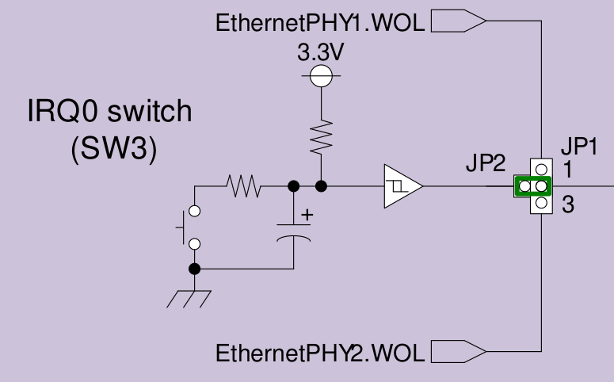

.. _irq_keys_sample:

IRQ keys sample
###############

Overview
********
This example demonstrates how to work with the IRQ keys, i.e., pin control has to select
the function of the keys as IRQ inputs.

Only one ISR handles all the keys' IRQs and sends an event to thread that is bound to a particular
key. The sample creates `key number - 1` additional threads. The last key is handled in the main
thread or if the one key only present in dts, threads aren't created.

By pressing the key `NUMBER_OF_CLICK_IN_ROW` times during `NUMBER_OF_MS_FOR_CLICK_IN_ROW` ms,
the sample switches the detection mode from `FALLING` to `RISING` edge and vice versa.

The IRQ0 switch block diagram of the RZ A2M EVK is shown in the picture below:

Requirements
************

This sample requires the support of a pincontrol, uart and interrupt-controller drivers.

References
**********

- :ref:`rz_a2m`

Building and Running
********************

 .. zephyr-app-commands::
    :zephyr-app: samples/drivers/rz_irq_keys
    :board: rz_a2m
    :goals: build flash debug
    :compact:
